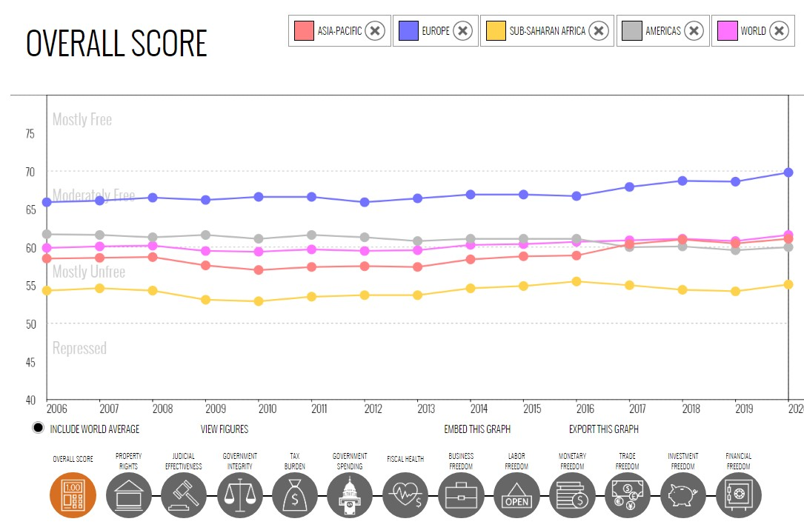
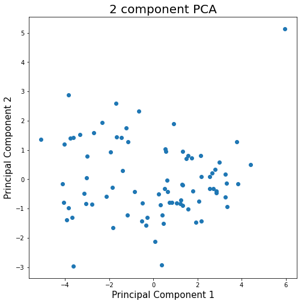
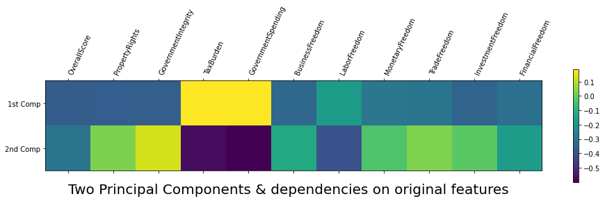
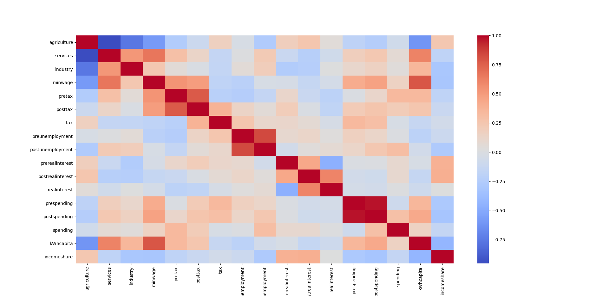
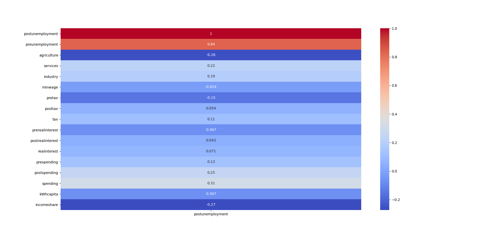
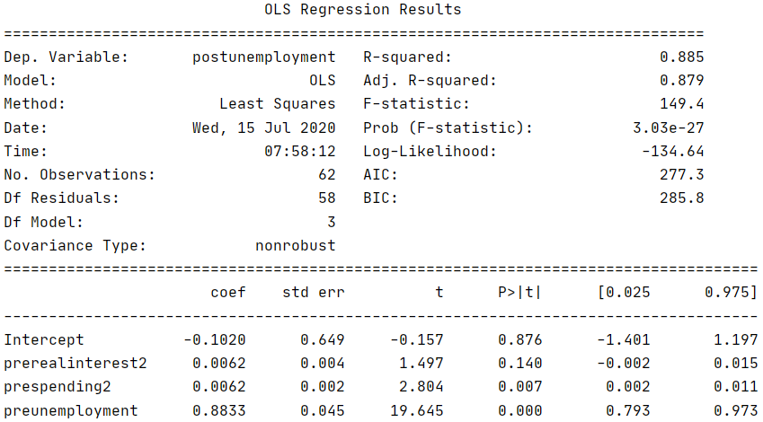

# Georgia Tech CS 4641 - Machine Learning Group 3 Project
## Analyzing Unemployment
Saikanam Siam, Matthew Oswald, Sanjit Kumar, Matthew K Attokaren

## Motivation
We are currently experiencing the second major economic recession of our lifetimes due to the COVID-19 pandemic. In the age of information, the advancement of machine learning algorithms has allowed us to gain more knowledge from global economic data than ever before [1]. Integrating data analysis with financial data has made tremendous strides in trading, fraud detection, and market forecasting [2]. These same techniques can be applied on large scale macroeconomic data for countries to find patterns between economic policy and statistics, and unemployment [3].  

The unemployment rate is a common metric used to describe a recession; however, a recession affects many more aspects of a country's economy. Our proposal is to use publicly available datasets to collect yearly attributes such as deficit, tax rates, interest rates, minimum wage, etc. and see if there is any clear correlation with the unemployment rate. Our main goal is to identify which factors or policies contribute to an increase in unemployment for countries.

The problem we are trying to solve is how can unemployment rates be predicted using publicly available data of countries’ yearly economic attributes (such as property rights, government integrity, tax burden, etc.) from the past decade? 

### Why is it important and why should we care? 
Economic recessions can have a major negative impact on countries and their citizens.  If we can learn which combination of economic indicators can predict a recession and increased unemployment, then governments and people can use this information to better prepare for a downturn and inform economic policy makers.

Additionally, there is a large amount of data available to the public. Economic forecasting is a vital tool for any country to have, and encouraging scientists and researchers to analyze this data could have profound positive impacts on a global scale.

## The Dataset
We obtained our attribute data set from the [Heritage Foundation](https://www.heritage.org/index/explore?view=by-region-country-year&u=637302137906965144).  The dataset contains thirteen indexes of economic freedom for each year.  These indices include Property Rights, Judicial Effectiveness, Government Integrity, Tax Burden, Government Spending, Fiscal Health, Business Freedom, Labor Freedom, Monetary Freedom, Trade Freedom, Investment Freedom and Financial Freedom. The Heritage Foundation records these indexes from over 150 countries, with some indexes dating back to 1995 for some of the countries.

We then obtained the unemployment rates fro each country from [The World Bank](https://data.worldbank.org/indicator/SL.UEM.TOTL.ZS).  This dataset contains the unemployment rates for each country, which we used as our labels.

We gathered data on multiple facets of economics that covers economics at a macro level and micro level instead of looking at them individually. Having so many different features reduces the risk of confounding variable skewing our dataset and us not being able to identify them, although this causes one of the primary problems with high-dimensionality also known as model overfitting. This is where PCA comes in. We used PCA to reduce our dataset to two principal components that would maximize the variance between countries.  This also allowed us to better visualize our dataset and see if there are any trends.

We did PCA analysis on the group of freedom attributes. We then created a heat map of the variables that were most influential using PCA. These were Government Spending and Tax Burden. This means that increased spending frfom the government along wigh a higher tax burden both increase unemployment. These findngs were similar to our basic linear regression results that we show later and go against Keysian economics.

### Method
First we look at a specific economic policy that was historically suggested and used during the first great depression, known as Keynesian policies. According to Keynesian Economics, there are three main ways a government can stabilize an economy during a recession. One way is to decrease interest rates. This allows easier borrowing for businesses and therefore creates more jobs. The second way a government can increase jobs is by decreasing taxes. This is based on the same idea that additional money in the hands of citizens will allow for more businesses to stay open. The third main way a government can stabilize a recession is by increasing spending to again put more money in the hands of citizens.

In order to analyze these policies, we used Regression and PCA to analyze the impact of Keynesian policies on unemployment. Furthermore, we tried and succeeded to back up some of our claims by finding the most important attribute predictors to unemployment by using PCA. The strong correlations between certain attributes and unemployment indicated to us that we could be able to generate an accurate predictor for unemployment. To evaluate our data, grouped our data into two training sets. We wanted to see if we could use a countries previous years' data to predict a future year's unemployment rate.  We also wanted to see if we could predict one countries unemployment rate by using other countries' data.

Our approach to analyzing the countries and yearly data was to break up the time series data into manageable data sets. Our entire data set consisted of 10 years of data, from 2009-2018, each year consisting of 135 countries. Each country had most of the attributes that we used from the Heritage Foundation data, and we used the unemployment statistics from WorldBank.org, specifically the modeled ILO estimate data in order to not have any data gaps.

We broke up the time series data by separating by country, then separating by year. We first created a separate DataFrame for every country, each consisting of that country’s data over the 10-year period. Our goal was to see how accurately we could predict the unemployment for a country given the first 9 years. Our testing data was the first 9 years for that country, and our model ran only for the 10th year, which we compared to the actual result. We did this for every country and analyzed the percent error for each country and the sum of squared differences overall. We then created a boxplot and scatterplot for the percent error. We tried many different regression algorithms to see which one would work the best. Normal Linear Regression gave the worst results, with a high sum of squared differences and high mean percent error. We assumed that this would happen, given the complexity of our data, and then tried Kernel Ridge Regression due to the multicollinearity of our data. Additionally, we thought the Kernel Trick would help find more intricate clusters in the data. This was a significant improvement, and our sum of squared differences decimated while the mean percent error was halved. We decided to try more regression algorithms and tune slightly to see the best we can get. We decided to try least-angle regression, which is useful for high-dimensional data. This is good for us, since we had the same number of features as our data, since every country has a separate model. This also helped increase our accuracy. Lastly, we also implemented a Multi-Layer Perceptron Neural Network. Although it required the most tuning, we were able to achieve the best results using the neural network.

Once we knew that Neural Networks worked best for our data, we decided to move on to the next phase of analysis, which is analyzing all the countries on a year by year basis. We decided to hand pick 24 countries that had major affects due to the economic recession of 2008 or had a good trading relationship with the US at the time. The countries we researched and chose are China, Canada, Japan, Germany, United Kingdom, France, India, South Africa, Italy, Israel, Vietnam, Latvia, Chile, Netherlands, Bhutan, Qatar, Turkey, Ukraine, Greece, Belgium, Ethiopia, Lesotho, Zimbabwe, Ghana. We felt like this was a diverse mix of countries and a good subset to test on. We used all the other countries as our training data and ran the algorithm for every year. All of these tests definitely gave us more clarity on what we are able to do and not able to do with the data in hand.

### Results

We can notice a couple of basic correlations on the preliminary heatmap. For example, we can see that obviously the more farming an economy has, the fewer service employees the country has. Then we will start to notice other things like the higher the minimum wage, the more energy costs. We can see that the interest, taxes, and unemployment before the recession are correlated to those variables during the recession. The correlations to unemployment are:

Creating a Model to decide Changes
One major issue that our team had was that there is a very limited amount of consistent data for the countries. Of the features that we had, the maximum number of data points was 162 and the minimum was 80. This created a necessity to make our model as simple as possible as including all potential features would limit our data to only 23 data points. To ensure we only kept only the most important variables, we created a function much like regsubsets where it chooses the highest R^2 score from possible subsets and we are able to force certain features to be included in R except it accounted for potential blank data points for each combination as opposed to the whole dataset (Our function only seemed efficient enough to work on up to around 200 combinations).

Variables that don't affect future unemployment: Initial Government Spending (prespending), Change in Real Interest Rates (realinterest), Real Interest Rates (prerealinterest), and Change in Taxation Rates (tax).
All of these had P>|t| of .4 or more.
Our final model for identifying changes in policy looked like this:

Based on this model, we can choose two policies between monetary and fiscal policy.
Decrease Spending During a Recession: We see that there is no impact on unemployment based on initial spending, but we see that there is a positive correlation between the act of increasing spending and unemployment. This goes against Keynesian economics, but a possible explanation would be that increased spending makes people wary of the possibility of a country going bankrupt and therefore less advantageous for business.
Make Taxes on income, profits and capital gains 42% Before the Next Recession: We can see that the 2007 tax variable is -.0757X+.0009X^2 If we solve for the minimum, we can see that we can decrease unemployment by up to 1.6% by putting the taxes to 42%.

We then moved on to our prediction algorithms. Our results for each algorithm are as follows. Our final algorithm was able to achieve a mean percent error of around 11.4 percent. We considered this to be a good model, and we think that it is an accurate predictor of a country’s unemployment rate. 

### Conclusion

### References
- [1] Athey, S. (2018). The impact of machine learning on economics. In The economics of artificial intelligence: An agenda (pp. 507-547). University of Chicago Press. 

- [2] Puglia, M., & Tucker, A. (2020). Machine Learning, the Treasury Yield Curve and Recession Forecasting. 

- [3] Katris, C. (2020). Prediction of unemployment rates with time series and machine learning techniques. Computational Economics, 55(2), 673-706. 

- [4] Jahan, S., Mahmud, A. S., & Papageorgiou, C. (2014). What is Keynesian economics?. International Monetary Fund, 51(3). 
